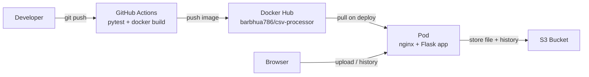
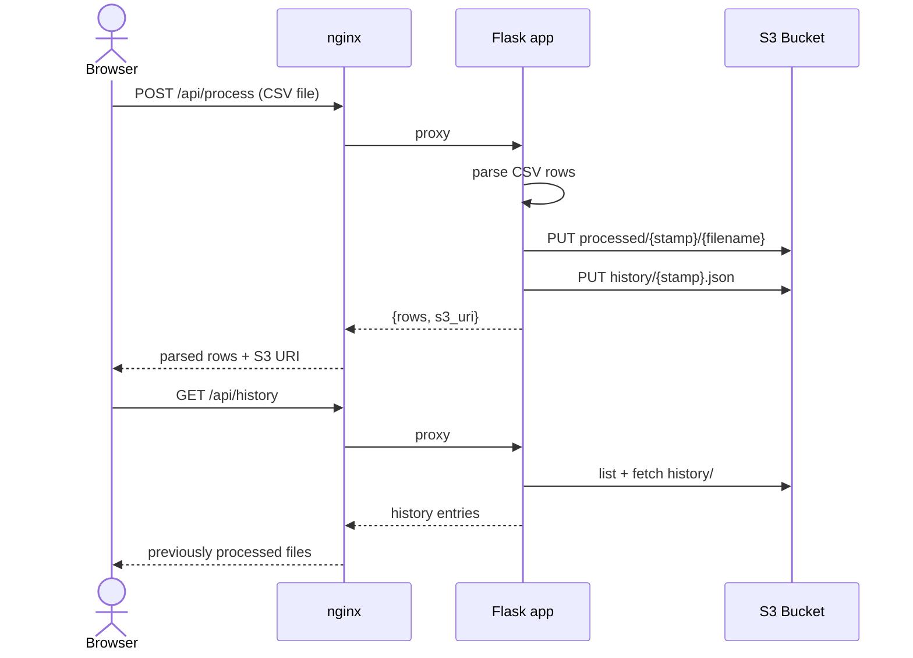

# CSV Processor Application

Python Flask app served behind Nginx in a single container image. Kubernetes deployment lives in [csv-processor-k8s-assets](https://github.com/asif-ahmedb/csv-processor-k8s-assets).

**Repository:** https://github.com/asif-ahmedb/csv-processor-app

## System overview



## CSV upload — sequence



## GitHub Actions → Docker Hub

Private image: **[barbhua786/csv-processor](https://hub.docker.com/r/barbhua786/csv-processor)**

On every push to `main`, CI runs **pytest**, builds the image, pushes to Docker Hub, and verifies tags.

### GitHub secrets

**csv-processor-app** → Settings → Secrets and variables → Actions:

| Secret | Value |
|--------|--------|
| `DOCKERHUB_USERNAME` | `USERNAME` |
| `DOCKERHUB_TOKEN` | `TOKEN` |

### Confirm push succeeded

1. GitHub → **Actions** → **Build and push Docker image** → all steps green.
2. [Tags on Docker Hub](https://hub.docker.com/r/barbhua786/csv-processor/tags) — `latest` and the commit SHA.

```bash
docker pull barbhua786/csv-processor:latest
```

**Note:** Pull requests only build (no push).

## Local run

```bash
docker build -t csv-processor:local .
docker run --rm -p 8081:8081 \
  -e S3_BUCKET=your-bucket \
  -e AWS_REGION=us-east-1 \
  -e AWS_ACCESS_KEY_ID=... \
  -e AWS_SECRET_ACCESS_KEY=... \
  csv-processor:local
```

Open http://localhost:8081 and upload `sample-data/soh.csv` (or `sample-data/example.csv`).

## Tests

```bash
cd web
pip install -r requirements.txt
pytest tests/ -v
```

## CSV format (SOH)

Matches the attached SOH export — **no header row**, three quoted columns per line:

```text
"211627629","Purple Safi Kaftan","4900.0000"
```

Columns: `product_id`, `product_name`, `price`. Full sample: `sample-data/soh.csv`.

## Environment variables

| Variable | Description |
|----------|-------------|
| `S3_BUCKET` | Target bucket for processed files |
| `AWS_REGION` | AWS region |
| `S3_ENDPOINT_URL` | Optional (MinIO/localstack) |
| `S3_STORAGE_CLASS` | e.g. `STANDARD` |
| `MAX_UPLOAD_BYTES` | Max upload size (default 10MB) |

## Related repositories

| Repository | Purpose |
|------------|---------|
| [csv-processor-k8s-assets](https://github.com/asif-ahmedb/csv-processor-k8s-assets) | Helm chart, Ansible values, and Minikube scripts to deploy this app on Kubernetes (local or AWS). |
| [csv-processor-infrastructure](https://github.com/asif-ahmedb/csv-processor-infrastructure) | AWS cluster and storage — kops bootstrap/teardown or Terraform EKS, S3 buckets, and IRSA for pod access. |
